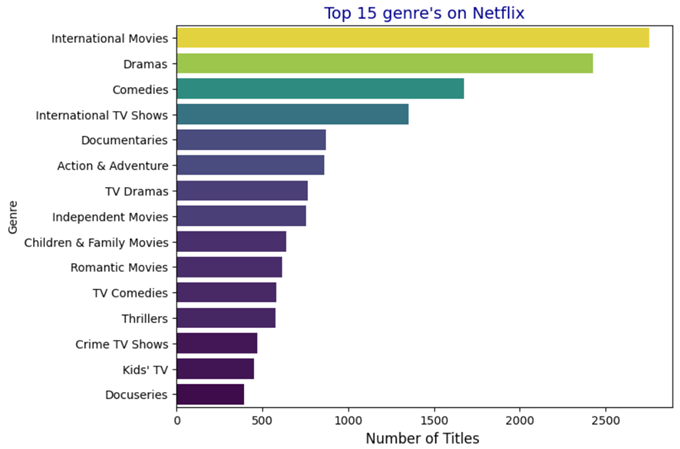
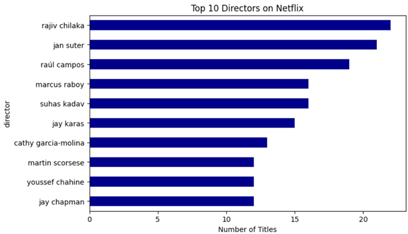

🎥 Netflix Dataset Analysis: Trends & Insights from Old to New

🔍 Project Overview

This project presents an in-depth analysis of the Netflix Titles dataset to uncover trends and extract meaningful insights about the transformation of the entertainment industry. By exploring metadata from thousands of movies and TV shows available on Netflix, we aim to understand how content production, genres, and global distribution have evolved over time.

📊 Goal

To analyze and extract insights from Netflix's dataset in order to understand where the entertainment industry is heading—from older, classic content to modern, diverse, and global productions.

!!!! Dataset Description

File: netflix_titles1.csv
Records: ~8,800 entries
Attributes Include:
show_id, type, title, director, cast,country, date_added, release_year, rating, duration, listed_in, description

!!!! Data Quality Check

A cleaning function was created to assess dataset quality:

❌ Missing Values: 4,307

✅ Duplicate Rows: 0

✅ Outliers in Numeric Columns: 0

❌ Inconsistent Object Columns: 11

⚠️ Conclusion: Dataset needs cleaning due to significant missing values and type inconsistencies.

📊 Exploratory Data Analysis

!!!! Type Distribution

✅ Movies dominate the catalog
⬆️ TV Shows are gradually increasing in volume
🌍 Country Trends

Top 3 content-producing countries:

United States
India
United Kingdom

Visualizations highlight global content expansion

!!!! Temporal Trends

Content sharply increases after 2015
Major additions during 2018-2020 period

!!!! Genre Breakdown

Popular genres:

Dramas
International Movies
Comedies
Indicates viewer interest in storytelling and cultural diversity

!!!! Duration & Format

Movies: durations in minutes
TV Shows: number of seasons
Runtime distributions show a preference for shorter films

!!!! Content Ratings

Dominated by TV-MA, TV-14, R, PG-13
Suggests a target toward mature and teen audiences

📈 Key Insights

Netflix is becoming a global distributor of content
Shift from regional to international storytelling
Growth of TV content signifies binge-watching culture
Rise of diverse genres and formats

##  Visual Insights

Below are some key visualizations from the dataset analysis:

---

### Content Type Distribution (Movies vs TV Shows)

---

### Release Year Trend: Movies vs TV Shows

---

### Genre Richness (Top 15 Genres)

---

### Top 10 Directors

---

### Top 10 Actors

---

### Word Cloud from Descriptions

---

### Heatmap of Content Added Over Time

🧠 Future Work

NLP on description to classify or recommend content
Predictive modeling: release year, genre, or duration
Visual dashboards for interactive exploration (e.g., Streamlit)

📚 Tech Stack

Python (Pandas, NumPy, Matplotlib, Seaborn)
Jupyter Notebook

📍 Credits

Dataset: Netflix Titles (dataset) on Kaggle

Analysis by: Indrayani Parande

